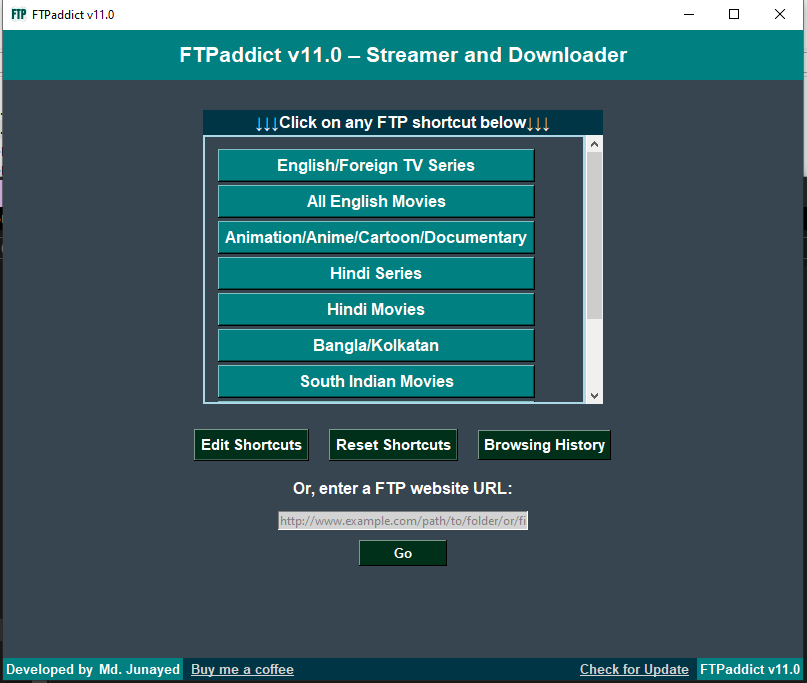
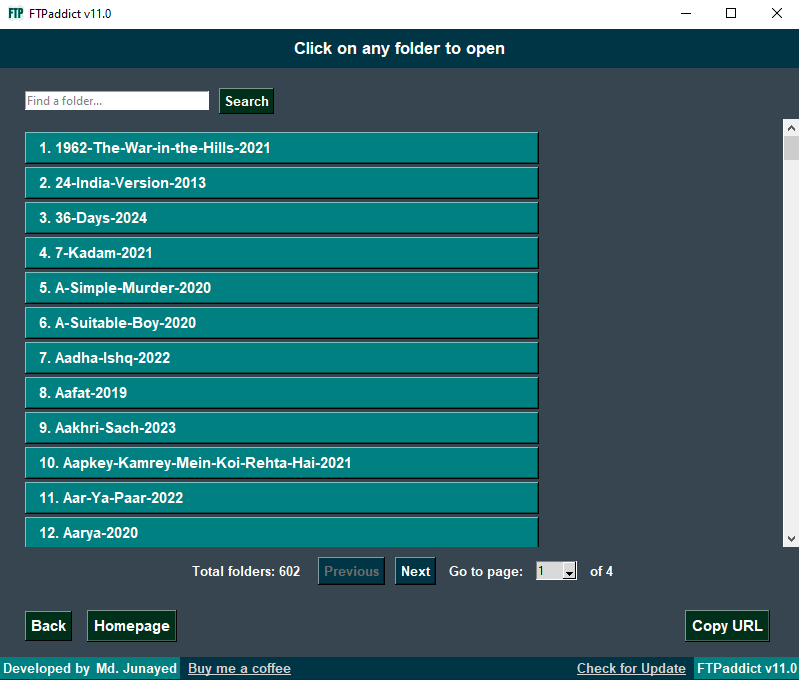
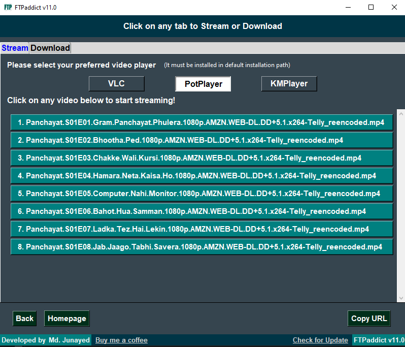
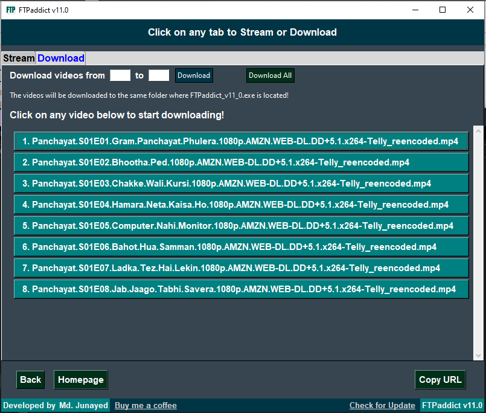
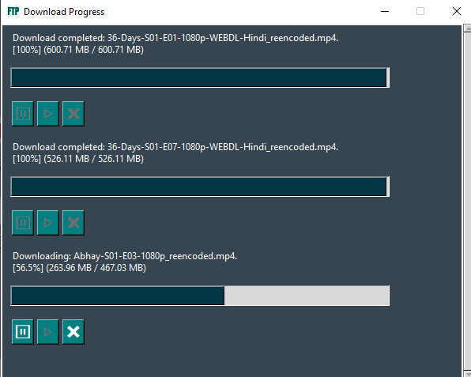

# FTPaddict V11.0

**FTPaddict** is a powerful tool designed for easy streaming and downloading of videos from FTP servers.

## What's New in v11.0

- **Screen Freeze Issue Fixed**  
- **Multiple Downloads from Different URLs Now Supported**  
- **Improved Download Progress Window**  
- **Added More Bugs to Fix Later :3**

**⚠️ Important: ⚠️**  
- Please **backup your `FTPaddict_cache`** from the previous version if you don’t want to lose your saved FTP shortcuts.  
- Please **backup your old version** as you might face errors running this new version on your system.

## Discussion / Community Feedback

See what people are saying about FTPaddict:  
[TrickBD Discussion](https://trickbd.com/windows-pc/2166939/)

## Download and Setup

1. **Download**: [FTPaddict.zip](https://github.com/j-unayed/FTPaddict/releases/download/ftpaddictV11/FTPaddict.zip)  
2. **Extract**: Right-click on `FTPaddict.zip` and select `Extract All...`  
3. **Open**: Go to the extracted folder and double-click `FTPaddict.exe` to launch the application

**Important!**  
- **Don’t delete** the `_internal` folder or any content from the folder. The program will crash if you do so!  
- The first time you run `FTPaddict.exe`, Windows Defender might flag it as malware because it was converted from `.py` to `.exe` using `pyinstaller`. Click `Run Anyway` or add an exception from your security settings.  
- **Problem? Installation Tutorial**: [Demo and Installation of FTPaddict.exe - YouTube](https://youtu.be/1rgnIlw7zK8?si=wUhCR1yb269XV5-M)

## Start-up

Open FTPaddict by double-clicking the executable. You'll see a list of pre-configured FTP shortcuts on the homepage.

## Navigation

- **Access FTP Servers**: Click on any FTP shortcut to access a pre-configured server, or enter a custom FTP URL in the search bar and click `Go`.  
- **Browse**: Navigate through folders and files as you would in a standard file manager. Click on a folder to view its folder/video contents.  

- **History**: Your folder navigation will be recorded in the history (max 100 entries). Click on the `Browsing History` button on the homepage to view history. Click `Clear` to delete all history entries.  
- **Search**: Use the search bar to find specific folders. Navigate to a Video List Folder to start streaming or downloading.

## Streaming and Downloading

### Stream Tab

- Select the media player (VLC, PotPlayer, or KMPlayer) and click on any video to start streaming.  
- A playlist of all videos in that folder will be created in order, allowing seamless sequential playback.

### Download Tab

- Click on any video to download only that specific video.  
- Specify a range of videos (from and to) and click `Download` to start downloading those videos.  
- Click on `Download All` to start downloading all videos in that folder at once.  
- **Download Location**: Downloaded videos are saved in the `Downloads` folder:  
  `file:///your:/path/to/FTPaddict.exe/Downloads/`

## Customizing FTPaddict

- **Edit Shortcuts**: Click on `Edit Shortcuts` on the homepage to customize the list of FTP servers. Modify, add, or delete shortcuts (up to five). After making changes, click `Save Shortcuts` to apply.  
  *Tip*: Use the `Copy URL` button in your desired folder and paste it in shortcuts.  
- **Reset Shortcuts**: Reset shortcuts to default by clicking `Reset Shortcuts`.

## Contact Me

For suggestions or support:

- **Email**: [mdjunayed733@gmail.com](mailto:mdjunayed733@gmail.com)  
- **Facebook**: [http://m.me/junayed733/](http://m.me/junayed733/)  
- **Support Me**: 01728078733 (bKash/Rocket)
